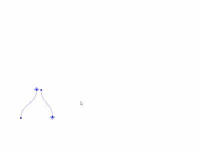
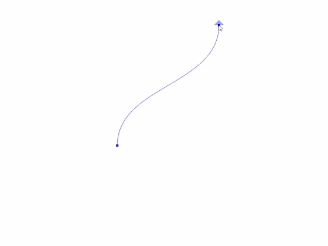

# CubicBezierCurves

An implementation of Cubic Bezier Curves in C++ using OpenGL, glut.

Curves could be dragged and change direction

Curves_01.exe has been added to [/bin](https://github.com/LOOK2001/Light2D/tree/master/bin) (only for 64 bit on Windows)

## Example

 

## Built With

* [freeglut](http://freeglut.sourceforge.net/) - Used to draw graphics on the window.

## Authors

* **Wang Xicheng**